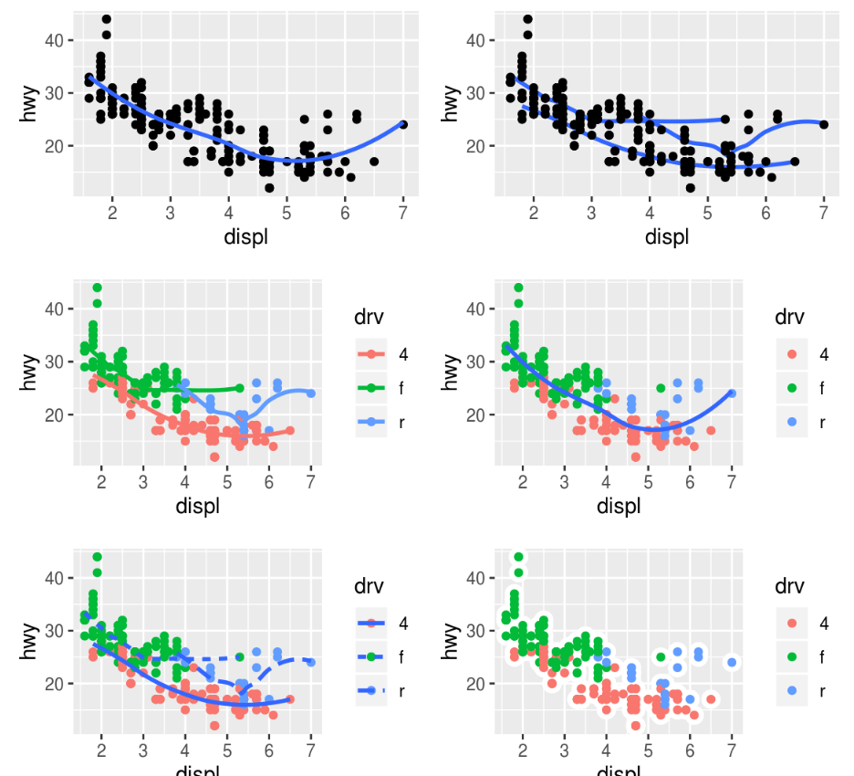

## 3.2.4 Exercises

```{r message=FALSE, warning=FALSE}
library(tidyverse)
```

### 1. Run ggplot(data = mpg). What do you see?

```{r}
ggplot(data = mpg)
```

Blank plot.


### 2. How many rows are in mpg? How many columns?

```{r}
nrow(mpg)
ncol(mpg)
```


### 3. What does the drv variable describe? Read the help for ?mpg to find out.

`drv` describes the drivetrain of the car - frontwheel, rear wheel or all wheel drive.


### 4. Make a scatterplot of hwy vs cyl.

```{r echo=FALSE}
ggplot(mpg) + aes(hwy, cyl) + geom_point()
```

### 5. What happens if you make a scatterplot of class vs drv? Why is the plot not useful?

```{r echo=FALSE}
ggplot(mpg) + aes(class, drv) + geom_point()
```

Scatter plots are useful for numeric data. Here both variables are categorical.


## 3.3.1 Exercises

What's gone wrong with this code? Why are the points not blue?

```{r}
ggplot(data = mpg) + 
  geom_point(mapping = aes(x = displ, y = hwy, color = "blue"))
```

`color = "blue"` must be an argument of `geom_point()`, not `aes()`. `aes()` creates a literal column with all its values equal to blue.


### 1. Which variables in mpg are categorical? Which variables are continuous? (Hint: type ?mpg to read the documentation for the dataset). How can you see this information when you run mpg?

trans, drv, fl and class are categorical. Rest are numeric.

### 2. Map a continuous variable to color, size, and shape. How do these aesthetics behave differently for categorical vs. continuous variables?

```{r echo=FALSE}
ggplot(mpg) + aes(cyl, cty, color=cty, size=cty) + geom_line()
```

Continuous variables cannot be mapped to shape.

Continuous variables generates a gradient color scheme.

Continuous variables have are binned into categorical type for plot size.

### 3. What happens if you map the same variable to multiple aesthetics?

We have seen this in the above question. The variable will be reused and the behavior depends on the the aesthetic.

### 4. What does the stroke aesthetic do? What shapes does it work with? (Hint: use ?geom_point)

`stroke` is used to control the thickness of point shapes which have a border.

```{r echo=FALSE}
ggplot(mpg, aes(cty, hwy)) +
  geom_point(shape = 21, colour = "black", fill = "white", size = 5, stroke = 5)
```

### 5. What happens if you map an aesthetic to something other than a variable name, like aes(colour = displ < 5)? Note, you'll also need to specify x and y

```{r echo=FALSE}
ggplot(mpg) + aes(cty, hwy, color = displ < 5) + geom_point()
```

The expression `displ < 5` returns a vector of booleans. Each value (TRUE and FALSE) maps to a different color in this case.


## 3.5.1 Exercises

### 1. What happens if you facet on a continuous variable?

```{r echo=FALSE}
ggplot(mpg) + aes(hwy, cty) + geom_point() + facet_wrap(~ hwy)
```

New facets are created ffor each unique value in the continuous value.

### 2. What do the empty cells in plot with facet_grid(drv ~ cyl) mean? How do they relate to this plot?

```{r echo=FALSE}
ggplot(data = mpg) + 
  geom_point(mapping = aes(x = drv, y = cyl))
```

It means that no rows or observations exist for that combination of drv and cyl.


### 3. What plots does the following code make? What does . do?

```{r}
ggplot(data = mpg) + 
  geom_point(mapping = aes(x = displ, y = hwy)) +
  facet_grid(drv ~ .)

ggplot(data = mpg) + 
  geom_point(mapping = aes(x = displ, y = hwy)) +
  facet_grid(. ~ cyl)
```

It creates a scatter plot of displ vs hwy, facetd by drv. The `.` notation in a formula simply means all other columns.

### 4. Take the first faceted plot in this section:

```{r}
ggplot(data = mpg) + 
  geom_point(mapping = aes(x = displ, y = hwy)) + 
  facet_wrap(~ class, nrow = 2)
```

#### What are the advantages to using faceting instead of the colour aesthetic? What are the disadvantages? How might the balance change if you had a larger dataset?

Relationship between continuous variables can be inspected for each group of a third discrete variable separately. 

### 5. Read ?facet_wrap. What does nrow do? What does ncol do? What other options control the layout of the individual panels? Why doesn't facet_grid() have nrow and ncol arguments?

`nrow` and `ncol` specifies the number of rows and columns of panels. In facet_grid, the number of panels dependson the number of unique combinations of input variables.

### 6. When using facet_grid() you should usually put the variable with more unique levels in the columns. Why?

This creates a wider image as opposed to longer one. Visual inspections will be easier if the analyst does not have scroll through pages repeatedly.


## 3.6.1 Exercises

### 1. What geom would you use to draw a line chart? A boxplot? A histogram? An area chart?

`geom_line`, `geom_boxplot` and `geom_area` respectively.

### 2. Run this code in your head and predict what the output will look like. Then, run the code in R and check your predictions.

```{r displ-vs-hwy, eval=FALSE}
ggplot(data = mpg, mapping = aes(x = displ, y = hwy, color = drv)) + 
  geom_point() + 
  geom_smooth(se = FALSE)
```

It should produce a single image with `displ` on x axis, `hwy` on y axis. Each observation is shown as a scatter plot and also a smooth trend line created with loess function.

```{r ref.label="displ-vs-hwy"}
```

### 3. What does show.legend = FALSE do? What happens if you remove it?

The legend box describes what line, color, or shape represents in the plot. Setting the `show.legend = FALSE` will produce a plot without the legend box. Removing the argument will make ggplot use the default value of TRUE, so that the legend box will be displayed.

### 4. Why do you think I used it earlier in the chapter?

The point was to demonstrtate different geometric objects. Legend box would have added unnecessary detail to it which would have led to confusion.

### 5. What does the se argument to geom_smooth() do?

It will show the confidence interval on each smoothing line.


### 6. Will these two graphs look different? Why/why not?

```{r eval=FALSE}
ggplot(data = mpg, mapping = aes(x = displ, y = hwy)) + 
  geom_point() + 
  geom_smooth()

ggplot() + 
  geom_point(data = mpg, mapping = aes(x = displ, y = hwy)) + 
  geom_smooth(data = mpg, mapping = aes(x = displ, y = hwy))
```

Both will produce he same plot. In the first case, `geom_point()` and `geom_smooth()` will inherit the aesthetics from `ggplot()`, while in second case, the aesthetics are specified explicitly.

### 7. Recreate the R code necessary to generate the following graphs.



```{r message=FALSE}
ggplot(mpg) +
  aes(displ, hwy) +
  geom_point(size = 2) +
  geom_smooth(color = "blue", size = 2, se = FALSE)

ggplot(mpg) +
  geom_point(mapping = aes(displ, hwy), size = 5) +
  geom_smooth(mapping = aes(displ, hwy, group=drv), size = 2, se = FALSE)

ggplot(mpg) +
  aes(displ, hwy, group = drv, color = drv) +
  geom_point(size = 5) +
  geom_smooth(se = FALSE, size = 2)

ggplot(mpg) +
  geom_point(mapping = aes(displ, hwy, color=drv), size = 5) +
  geom_smooth(mapping = aes(displ, hwy), se = FALSE, size = 2)

ggplot(mpg) +
  aes(displ, hwy, group = drv) +
  geom_point(mapping = aes(color=drv), size = 5) +
  geom_smooth(mapping = aes(linetype=drv), se = FALSE, size = 2)

ggplot(mpg) +
  aes(displ, hwy, group=drv) +
  geom_point(size = 5)
```


## 3.7.1 Exercises

### 1. What is the default geom associated with stat_summary()? How could you rewrite the previous plot to use that geom function instead of the stat function?

`geom_histogram()` is the default.

```{r}
ggplot(mpg) +
  aes(class, hwy) +
  geom_pointrange(fun.ymin = min, fun.ymax = max, fun.y = median, stat = "summary")
```

### 2. What does geom_col() do? How is it different to geom_bar()?

`geom_bar()` is a frequency plot. `geom_col()` should be used to draw a bar chart of the values in the observations.

### 3. Most geoms and stats come in pairs that are almost always used in concert. Read through the documentation and make a list of all the pairs. What do they have in common?

From the documentation:

```{r eval=FALSE}
geom_bar() geom_col() stat_count() 
# Bar charts

geom_bin2d() stat_bin_2d() 
# Heatmap of 2d bin counts

geom_boxplot() stat_boxplot() 
# A box and whiskers plot (in the style of Tukey)

geom_contour() stat_contour() 
# 2d contours of a 3d surface

geom_count() stat_sum() 
# Count overlapping points

geom_density() stat_density() 
# Smoothed density estimates

geom_density_2d() stat_density_2d() 
# Contours of a 2d density estimate


geom_hex() stat_bin_hex() 
# Hexagonal heatmap of 2d bin counts

geom_freqpoly() geom_histogram() stat_bin() 
# Histograms and frequency polygon


geom_qq_line() stat_qq_line() geom_qq() stat_qq() 
# A quantile-quantile plot

geom_quantile() stat_quantile() 
# Quantile regression

geom_smooth() stat_smooth() 
# Smoothed conditional means

geom_violin() stat_ydensity() 
# Violin plot
```

### 4. What variables does stat_smooth() compute? What parameters control its behaviour?

`stat_smooth()` computes a smooth curve over continuous variables. The `method` parameter is the main parameter which controls how the smoothign is done. It supports one of 5 options - lm, glm, gam, loess and rlm.

### 5. In our proportion bar chart, we need to set group = 1. Why? In other words what is the problem with these two graphs?

```{r}
ggplot(data = diamonds) + 
  geom_bar(mapping = aes(x = cut, y = ..prop..))

ggplot(data = diamonds) + 
  geom_bar(mapping = aes(x = cut, fill = color, y = ..prop..))
```

`geom_bar()` is a frequency plot. If the aesthetics does not contain grouping, all the plots contain a value of 1. `group = 1` specifies that the first column should be used for frequency count.


## 3.8.1 Exercises

### 1. What is the problem with this plot? How could you improve it?

```{r}
ggplot(data = mpg, mapping = aes(x = cty, y = hwy)) + 
  geom_point()
```

There is obvious linear relationship between variables. `geom_smooth()` can be added to show this in visual analytics.

### 2. What parameters to geom_jitter() control the amount of jittering?

`width` and `height` arguments.

### 3. Compare and contrast geom_jitter() with geom_count().

`geom_jitter()` adjusts a point, which helps to avoid overplotting. `geom_count()` is a variation of `geom_point()`, which adjusts the point size according to the number of observations.

```{r}
ggplot(mpg) + aes(cty, hwy) + geom_count()

ggplot(mpg) + aes(cty, hwy) + geom_jitter()
```

### 4. What's the default position adjustment for geom_boxplot()? Create a visualisation of the mpg dataset that demonstrates it.

The default value is `dodge`.

```{r}
ggplot(mpg) + aes(cyl, cty, group=cyl) + geom_boxplot()
```


## 3.9.1 Exercises

## 1. Turn a stacked bar chart into a pie chart using coord_polar().

```{r}
ggplot(diamonds) + aes(clarity, fill=cut) + geom_bar() + coord_polar()
```

### 2. What does labs() do? Read the documentation.

It is used to modify labels for the axis, legend and plot title.

### 3. What's the difference between coord_quickmap() and coord_map()?

`coord_quickmap()` preserves straight lines on the 2D map projection while `coord_map()` does not.

### 4. What does the plot below tell you about the relationship between city and highway mpg? Why is coord_fixed() important? What does geom_abline() do?

```{r}
ggplot(data = mpg, mapping = aes(x = cty, y = hwy)) +
  geom_point() + 
  geom_abline() +
  coord_fixed()
```

As cty increases, hwy also increases. The relationship is linear as we can see from the plot.

`coord_fixed()` forces the x and y axis unit aspect ratio to 1:1, so that visual analysis is unaffected by difference in units.

`geom_abline()` adds a straight line to the plot. In this case, the function shows the linear regression line.

